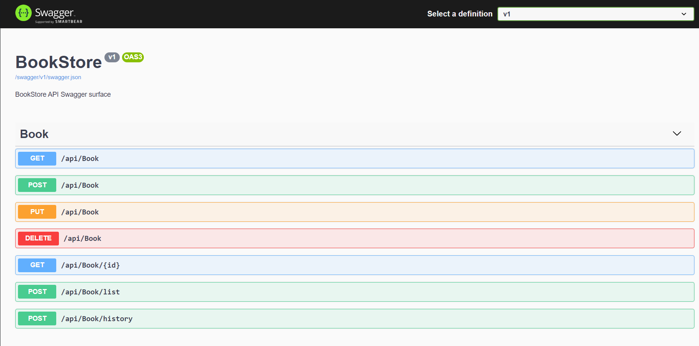
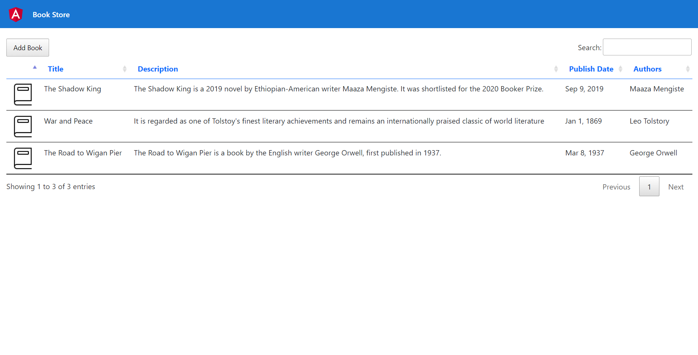
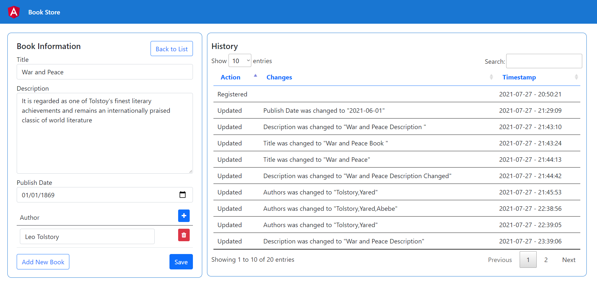

# BookStore
A simple bookstore web app that has a web front-end in Angular with a backend component that displays the history of changes of book entities with pagination, filtering, ordering and optionally grouping. The backend component is based on ASP.NET Core 3.1 with DDD, CQRS, and Event Sourcing concepts.

## Technologies
- .NET Core 3.1
- Entity Framework Core 5.0.5
- Npgsql.EntityFrameworkCore.PostgreSQL 5.0.5
- AutoMapper 10.0
- Swashbuckle.AspNetCore 6.1.1
- NetDevPack 5.0.3
- Mediatr 9.0

## Steps to run the application
### Backend
- cd to `src/BookStore.Infrastructure.Data` folder
- Update the database connection strings hard-coded for EF migration inside context factory classes (i.e., `Context\EventStoreSqlContext.cs` and `Context\BookStoreContext.cs`)
- Run migration for EventStoreSqlContext `dotnet ef database update --context EventStoreSqlContext`
- Run migration for BookStoreContext `dotnet ef database update --context BookStoreContext`
- cd to `src/BookStore.API` folder
- Make sure that you have updated database connection string in the `appsettings` files
- Run application `dotnet run`

### Frontend
- cd to `src/BookStore.Web` folder
- Install packages `npm install`
- Run the Angular application `ng serve`

## Screenshots
### API documentation using Swagger

### Book list page

### Book detail information and history page

## Suggestion for improvement
- Grouping of book changes history by certain parameters
